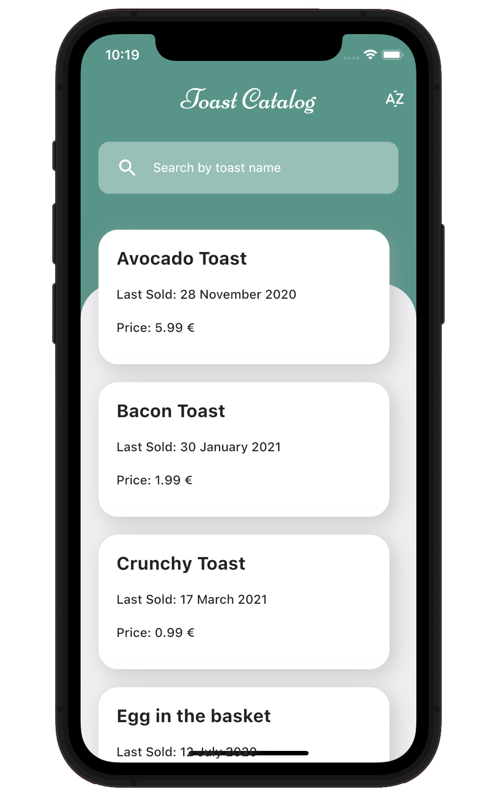
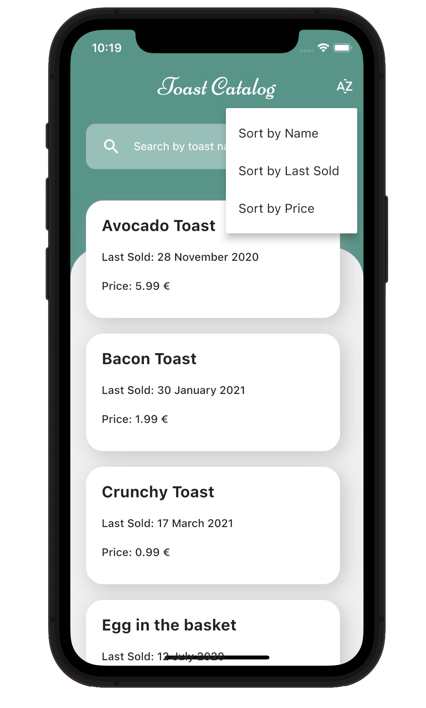
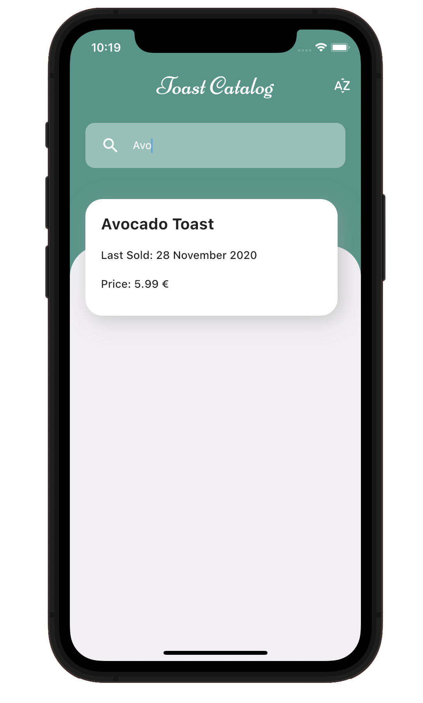
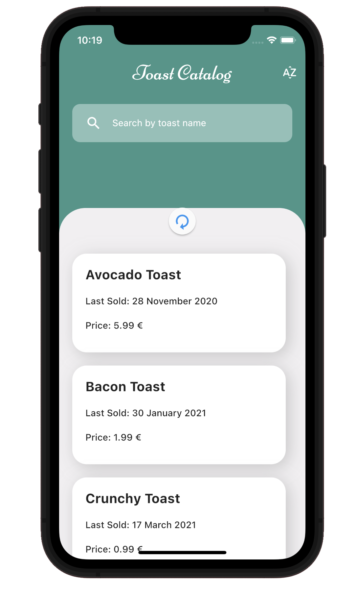

# Toast Catalog

## Overview
Welcome to Toast Catalog, a Flutter app designed for managing and displaying a dynamic list of items sourced from an external API. This app empowers users to explore, sort, and search for items in an intuitive and user-friendly interface.

## Screenshots

  
  

## Features

- **Item Management**: Easily manage and display a list of items fetched from an external API.
- **Sorting Options**: Sort items by name, last sold date, or price.
- **Search Functionality**: Quickly find items using the search box.
- **Offline Support**: Items are stored locally for seamless offline access.
- **API Integration**: Connects to an external API to fetch the latest item data.
- **Connection Status Check**: Dynamically assesses internet connectivity, providing an error notification if unable to connect to the server.
- **Fallback to Offline Mode**: In the absence of a connection, the app intelligently switches to displaying items from the offline list.
- **Pull-to-Refresh**: Update the item list by pulling down on the screen.
- **Custom Fonts**: Enhance the visual appeal with the Niconne custom font.

## Content Attribution

- **Font (Niconne)**: Used the Niconne font, which is available on [Google Fonts](https://fonts.google.com/specimen/Niconne?preview.text=Good%20morning&query=Vernon+Adams&classification=Handwriting). The font was designed by Vernon Adams.

## Technologies Used
- **Flutter**: Framework for building natively compiled applications.
- **Dart**: Language used to build Flutter applications.
- **HTTP Package**: Used for making HTTP requests to download item data.
- **Storage Package**: Used for reading/writing data locally.
- **Linting**: The codebase adheres to best practices and coding standards using lint rules.
- **Widget Tests**: Extensive use of widget tests to ensure the robustness of the UI components, behaviors, and overall application functionality.

## Responsiveness

The app is designed to work seamlessly across various screen sizes, providing a consistent and enjoyable experience on both small and large devices.

## API Connection
Toast Catalog connects seamlessly to an external API to fetch real-time data, ensuring that users have access to the latest information.

